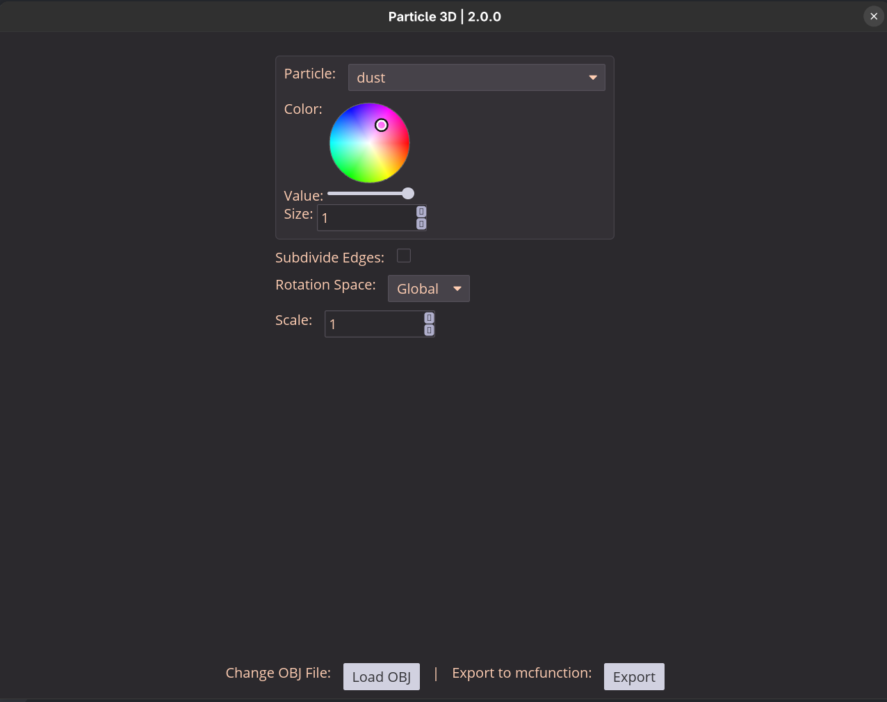

# Particle 3d [2.0.0]
> 
> > Image featured is of beta version, however not much has visuaally changed
## How to use ❓
1. Create a model in blender or simmilar modelling software (If you want to use different particles for different aprts, use a separate model for each particle)
2. Ensure this model is triangulated
3. Export as a `.obj` file  
**!IMPORTANT!**  DO NOT INCLUDE SPACES IN THE FILE NAME
4. Open the app
5. Select the `.obj` file
6. Set your settings (particle(s), rotation space, edge subdivisions)
7. Export the `.mcfunction` file to your datapack

## Examples
### Single Object
#### Cube
> A simple cube to demonstrate the idea  

> 

#### Suzzane
> A more complex model, also its the blender monkey

> 

### Multi Object
#### Suzzane & Ball
> It's the blender monkey and an icosphere!

> 
