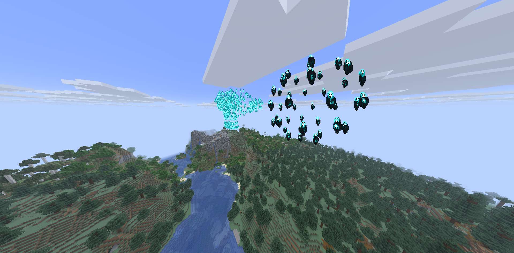

# Descriptor
A Multi-Model collection of suzzane and an icosphere 

# Settings Used
> Individual Particles per Object: `true`  
> Object 0: `soul_fire_flame`  
> Object 0: `sculk_soul`  
> Subdivide Edges: `false`   
> Rotation Space `global`

# Result
> 
